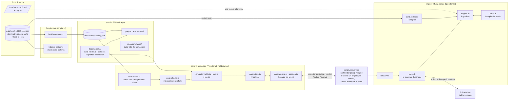
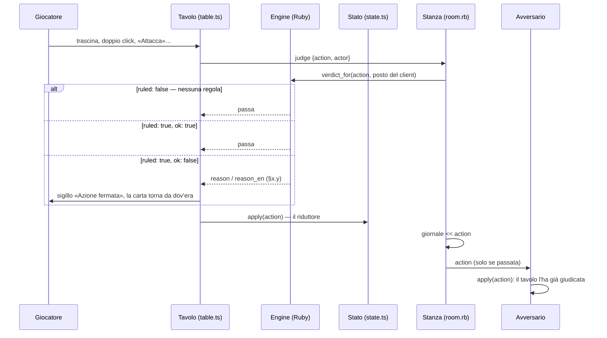
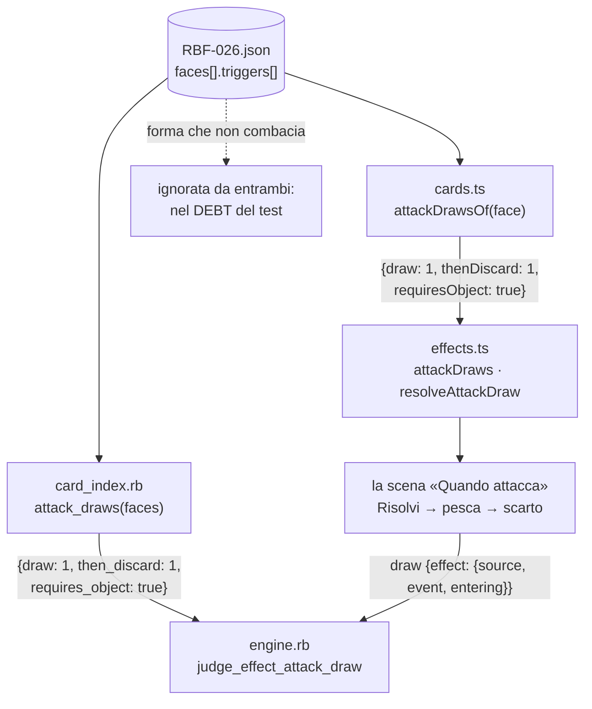

# Rubyfront

Un gioco di carte in due, e gli strumenti per farlo vivere: il catalogo delle
carte, il sito che le mostra, il simulatore per giocarle online e l'engine
che fa rispettare le regole. Le regole stanno in `docs/MANUALE.md` (in
inglese: `docs/MANUAL.md`), il mondo in `docs/LORE.md`, la grafica in
`docs/ART.md`: sono le fonti di verità, tutto il resto discende da lì.

## Il disegno



Chi legge cosa:

| Pezzo | Legge | Quando |
|---|---|---|
| Sito e simulatore | `docs/cards/catalog.json` | a ogni apertura della pagina |
| `catalog.json` | `data/` | quando si lancia `node scripts/build-catalog.mjs` |
| Engine | `data/` | all'avvio di `ruby engine/bin/server` |
| Engine | `docs/MANUALE.md` | mai da solo: ogni § entra a mano, con i suoi test |

Le due **anagrafi** — `card_index.rb` nell'engine, `cardStats` in
`core/src/cards.ts` nel client — leggono gli stessi campi con gli stessi criteri:
tipo, razza, statistiche, abilitazioni e le **forme certificate** degli
effetti. Una forma che non combacia esattamente non entra: l'engine preferisce
ignorare un effetto piuttosto che fraintenderlo, e il test dell'anagrafe tiene
il conto di ciò che resta da collegare (il «debito dichiarato»).

## Come viaggia un'azione

Il simulatore è il poliziotto, l'engine dà le regole. Ogni gesto locale si
ferma finché l'arbitro non risponde; su un «no» il gesto non avviene e il
tavolo mostra il sigillo con il § del manuale.



Tre forme di regola, dalla più piccola:

1. **Dogana** — l'engine dice «no» a un'azione che c'è già (`toZone`, `declare`,
   `turn`…). Vive solo in `engine.rb`.
2. **Automatismo dei gemelli** — il tavolo fa da sé ciò che il manuale dà per
   scontato (la routine del cambio di turno, gli Oggetti che seguono
   l'Entità). Vive in `state.ts` **e** in `table.rb`, stessa semantica, test
   speculari.
3. **Azione calcolata e verificata** — il client calcola (risoluzione delle
   battaglie, fine partita, dado) e manda un'azione sola con l'esito;
   l'engine rifà il conto e passa solo un esito identico.

## Gli effetti delle carte



Ogni effetto certificato ha la stessa vita: un parser per mondo che legge la
**forma** dal JSON, un passo del giudizio che la verifica, un passo
dell'interprete che la esegue al tavolo, e il riferimento `effect` che
viaggia dentro l'azione (fonte, evento, ingresso) e consuma l'innesco una
volta per turno. Cambiare un numero dentro la forma aggiorna tutto da sé;
cambiare la forma chiede un parser nuovo nei due mondi — e il test del
debito lo dice.

## Dove gira

| Pezzo | In locale | In produzione |
|---|---|---|
| Gioco e catalogo | `npm run all` → vite su `:5199` (`/simulator/`, carte su `/cards`) e il gioco PixiJS su `:5200` | Vercel, build a ogni push (`vercel.json` → `scripts/build-site.mjs`): il **gioco alla radice** `/`, il **gioco PixiJS** sotto `/next`, il **catalogo** sotto `/catalog`; esce `dist/`, non si committa |
| Tavolo (engine) | `:8788` | Render, piano free, **un servizio solo** (`render.yaml` + `Dockerfile`, `scripts/server.mjs`, l'engine Ruby per proxy): `wss://rubyfront.onrender.com/engine` |
| Desktop (Steam) | `desktop/` (fuori dai workspace): `npm install`, `npm run prepare-app`, `npm start` — Electron col gioco PixiJS e le carte a bordo | eseguibili per Steam con `npm run pack:*`; cosa serve per pubblicare in `desktop/STEAM.md` |
| CI | — | GitHub Actions: test Ruby, tsc, vitest e build a ogni push (`ci.yml`); `keepalive.yml` tocca Render (ma GitHub lo fa girare ogni 2-4 ore: il server si tocca da solo, `scripts/server.mjs`) |

Tutto free (deciso 2026-09-07). Un processo solo su Render
(`scripts/server.mjs`: l'engine Ruby è un figlio raggiunto per proxy sul
percorso `/engine`). Dal 2026-09-11 **l'engine è l'unico a scrivere lo
stato**: non c'è più un relay che ripete le azioni fra i client — ogni
azione arriva al tavolo della stanza come richiesta di giudizio, e solo se
passa entra nel giornale e viene inoltrata all'avversario. L'indirizzo di
produzione è il default di `engine.ts`; la variabile `VITE_ENGINE_URL` al
build (Vercel) vince su tutto.

## Cartelle

- `data/` — i dati madre: un file per carta, più i testi in due lingue; i mazzi.
- `docs/` — il sito: manuale, lore, direzione artistica, catalogo, pagine, build del simulatore.
- `simulator/` — il client TypeScript (Vite, vitest), DOM: resta come termine di confronto.
- `game/` — il client nuovo in PixiJS (migrazione del 2026-09-11, verso Steam), col suo README.
- `core/` — la logica del client senza DOM, condivisa dai due client (workspace npm: `npm install` dalla radice).
- `engine/` — l'arbitro in Ruby (minitest), col suo README che racconta ogni regola collegata e i suoi limiti.
- `scripts/` — catalogo, validazioni, il server di produzione, pipeline di sviluppo, e il ponte col foglio dei mazzi.
- `.claude/skills/` — i contratti di lavoro: `linguaggio-carte` per i testi, `regole-engine` per le regole.

## Il foglio dei mazzi

I mazzi si disegnano su un foglio condiviso (Google Fogli), un sottofoglio per
mazzo. `npm run decks` è il ponte fra quel foglio e il catalogo: legge il
foglio, elenca i mazzi dicendo quali sono già in catalogo, e per quello scelto
mostra le differenze — copie, costo, Potenza, razza, Materia, parole chiave,
testo dell'effetto, e il blocco Rubyfront/Nexus in fondo. Col tuo sì apre una
sessione Claude che applica le modifiche seguendo le skill `linguaggio-carte`
e `regole-engine`, e poi riscrive il foglio dal catalogo — così il linguaggio
normalizzato torna anche lì. `npm run decks -- --export` fa solo quest'ultimo
passo.

Il foglio è privato, quindi due passaggi restano a mano, ed è voluto: nessun
programma entra nel tuo Drive.

1. su Fogli: **File → Scarica → Microsoft Excel**, in `~/Downloads`;
2. finito: **File → Importa → carica il file → «Sostituisci foglio di
   lavoro»**, così il documento resta lo stesso e il link condiviso non cambia.

Rendendo il foglio leggibile da chi ha il link, il primo passaggio si
automatizza: `npm run decks -- --url <link del foglio>`.

## Comandi

```sh
npm run all                          # simulatore + gioco + tavolo (engine), un Ctrl+C spegne tutto
npm run decks                        # il foglio condiviso dei mazzi ↔ il catalogo
node scripts/build-catalog.mjs       # data/ → docs/cards/catalog.json
node scripts/validate-data.mjs       # i dati e il catalogo sono allineati?
ruby engine/test/engine_test.rb      # e table_test, card_index_test, websocket_test
cd core && npx vitest run            # i gemelli lato client (riduttore, routine, sessione)
cd simulator && npx vitest run       # la geometria di vista del simulatore
node scripts/build-site.mjs          # dist/: gioco, gioco PixiJS (/next) e catalogo
```
